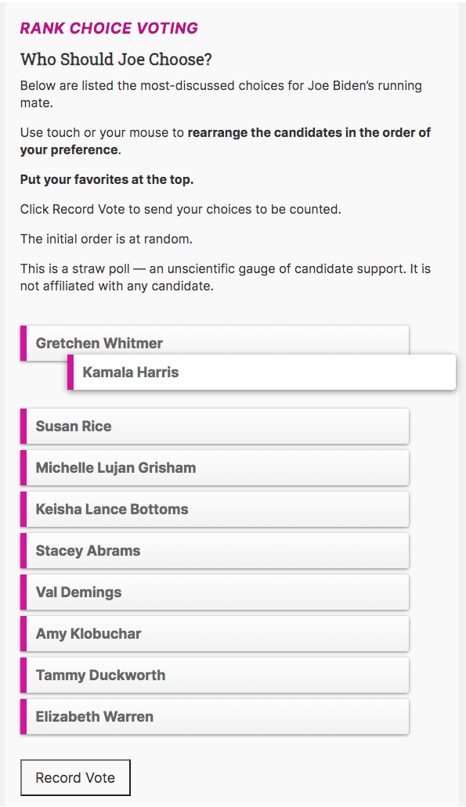

#RCV Slider module

This Drupal 8 module provides a drop-and-drag widget to enable rank choice voting.

After installation, a new content type called Poll is created.

You create a poll, then enter the choices that need to be ranked.

The module creates a React block that site visitors can use to record their choices by dragging and dropping the choices.

Demo: https://mychoices.vote/democratic-vp-2020

Then the choices are compiled, and the rank choice winner is revealed.

